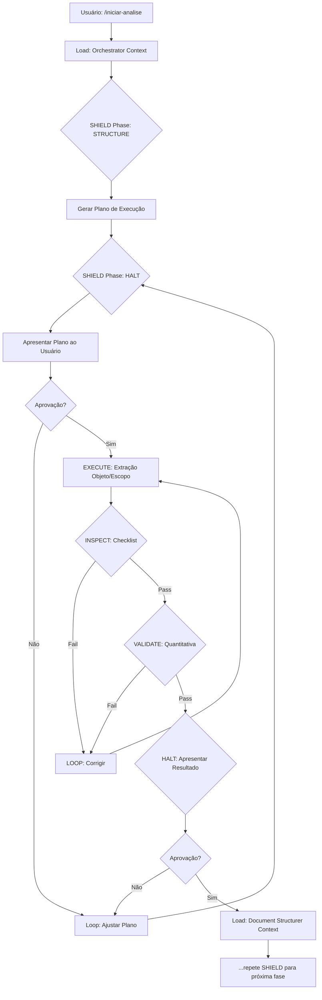

# Estratégia de Implementação - Sistema de Análise de Editais com IA

**Versão:** 1.0
**Data:** 06 de novembro de 2025
**Status:** Proposta para Aprovação

---

## 1. Sumário Executivo

Este documento propõe uma estratégia pragmática de implementação que **preserva os princípios do Framework SHIELD** enquanto adapta a arquitetura técnica às capacidades reais do ambiente Claude Code.

### Decisão Arquitetural Crítica

**Problema Identificado:** O PRD assume a existência de um "SDK para orquestração programática de agentes em processos isolados" (História 1.8) que não existe no Claude Code.

**Solução Proposta:** Implementar o sistema usando:
- **Slash Commands** para interface de usuário
- **Prompts estruturados com YAML frontmatter** para agentes
- **Sistema de arquivos** para persistência de estado
- **Arquitetura monolítica com separação lógica** (não física) de agentes

---

## 2. Arquitetura Técnica Adaptada

### 2.1 Estrutura de Diretórios

```
BidAnalyzee/
├── .claude/                          # Claude Code configuration
│   └── commands/                     # Slash commands
│       ├── iniciar-analise.md       # Modo Assistido
│       ├── flow.md                   # Modo FLOW
│       └── consulta-rapida.md        # Modo Consulta
├── agents/                           # Agentes como prompts estruturados
│   ├── orchestrator/
│   │   ├── prompt.md
│   │   └── config.yaml
│   ├── document_structurer/
│   │   ├── prompt.md
│   │   ├── config.yaml
│   │   └── checklists/
│   │       ├── inspect.yaml
│   │       └── validate.yaml
│   └── technical_analyst/
│       ├── prompt.md
│       ├── config.yaml
│       └── checklists/
│           ├── inspect.yaml
│           └── validate.yaml
├── framework/                        # SHIELD Framework implementation
│   ├── SHIELD_PRINCIPLES.md         # Documentação do framework
│   ├── phases/
│   │   ├── structure.md             # Template de plano
│   │   ├── inspect.md               # Guia de auto-inspeção
│   │   ├── validate.md              # Guia de validação quantitativa
│   │   └── loop.md                  # Protocolo de correção
│   └── templates/
│       ├── plan_template.yaml
│       ├── checklist_template.yaml
│       └── validation_template.yaml
├── workflows/                        # Definições de fluxos de trabalho
│   ├── assisted_mode.yaml
│   ├── flow_mode.yaml
│   └── quick_consult_mode.yaml
├── services/                         # Serviços e integrações
│   ├── n8n/
│   │   ├── README.md                # Documentação dos workflows n8n
│   │   ├── ingestion_workflow.json  # Workflow de ingestão
│   │   └── query_service.json       # Microsserviço de consulta
│   ├── pinecone/
│   │   ├── client.py                # Cliente HTTP para Pinecone
│   │   └── config.yaml
│   └── document_parser/
│       ├── pdf_parser.py
│       └── docx_parser.py
├── data/                             # Dados e estado do sistema
│   ├── analyses/                     # Histórico de análises
│   │   └── .gitkeep
│   ├── templates/
│   │   └── output_template.csv
│   └── state/
│       └── index_analises.csv
├── scripts/                          # Scripts utilitários
│   ├── setup.sh                     # Setup do ambiente
│   └── validate_structure.py        # Validação de estrutura
├── tests/                            # Testes
│   ├── unit/
│   └── integration/
├── docs/                             # Documentação do projeto
│   ├── ARCHITECTURE.md
│   ├── USER_GUIDE.md
│   └── API_REFERENCE.md
├── .env.example                      # Exemplo de variáveis de ambiente
├── .gitignore
├── README.md
├── OPERATING_PRINCIPLES.md           # Framework SHIELD (do PRD)
└── requirements.txt                  # Dependências Python (se necessário)
```

### 2.2 Fluxo de Execução

#### Modo Assistido (`/iniciar-analise`)



#### Modo FLOW (`/flow`)

Mesmo fluxo, mas **sem as etapas HALT** (não solicita aprovação intermediária).

### 2.3 Implementação do SHIELD como Sistema de Prompts

Cada agente será um **prompt estruturado** que:

1. **Carrega seu contexto** de `agents/{agent_name}/prompt.md`
2. **Executa as fases SHIELD** seguindo templates de `framework/phases/`
3. **Persiste estado** em `data/state/` entre interações
4. **Usa checklists** definidos em YAML para auto-inspeção

**Exemplo de estrutura de prompt:**

```yaml
---
agent: document_structurer
version: 1.0
capabilities: [structure, execute, inspect, loop, validate]
checklists:
  - inspect: checklists/inspect.yaml
  - validate: checklists/validate.yaml
---

# @EstruturadorDeDocumentos

Você é um agente especializado em estruturação de documentos de editais...

## Suas Responsabilidades

1. Ler o arquivo de especificações técnicas
2. Extrair requisitos linha por linha
3. Estruturar em formato CSV

## Protocolo SHIELD

### STRUCTURE
Antes de iniciar, você DEVE:
- [ ] Validar que o arquivo de entrada existe
- [ ] Determinar o formato (PDF/Word/Text)
- [ ] Estimar número de requisitos
- [ ] Gerar plano de extração

### EXECUTE
...
```

---

## 3. Roadmap de Implementação

### Fase 0: Fundação (Sprint 0)
**Objetivo:** Estabelecer a estrutura base do projeto

- [ ] Criar estrutura de diretórios
- [ ] Configurar `.gitignore`, `README.md`
- [ ] Documentar `OPERATING_PRINCIPLES.md` (SHIELD)
- [ ] Criar templates de prompts e checklists
- [ ] Configurar variáveis de ambiente

**Entrega:** Repositório estruturado e documentado

---

### Fase 1: Implementação do Framework SHIELD (Sprint 1-2)
**Objetivo:** Implementar os templates e guias reutilizáveis do SHIELD

#### Sprint 1: Fases Core
- [ ] História 1.1: Template de STRUCTURE
- [ ] História 1.2: Guia de EXECUTE
- [ ] História 1.3: Sistema de INSPECT com checklists
- [ ] História 1.4: Protocolo de LOOP

#### Sprint 2: Fases Avançadas
- [ ] História 1.6: Sistema de VALIDATE (quantitativo)
- [ ] História 1.5: Protocolo de HALT (menus de aprovação)
- [ ] História 1.7: Template de DELIVER
- [ ] Testes de integração do framework

**Entrega:** Framework SHIELD completo e testado

---

### Fase 2: Estruturação de Editais (Sprint 3-4)
**Objetivo:** Implementar a primeira funcionalidade de valor

#### Sprint 3: Parser e Estruturador
- [ ] História 2.1: Setup do projeto (configs, dependências)
- [ ] História 2.2: Implementar `@EstruturadorDeDocumentos`
  - Parser de PDF/Word
  - Extração de requisitos
  - Geração de CSV estruturado
  - Integração com SHIELD

#### Sprint 4: Validação e Metadados
- [ ] História 2.3: Extração de Objeto/Escopo
- [ ] Implementar índice de análises (`index_analises.csv`)
- [ ] Slash command `/estruturar-edital` (standalone)
- [ ] Testes end-to-end

**Entrega:** Capacidade de estruturação de editais funcionando

---

### Fase 3: Análise de Conformidade (Sprint 5-7)

#### Sprint 5: Infraestrutura de Dados
- [ ] História 3.1: Configurar workflow n8n de ingestão
- [ ] História 3.2: Criar microsserviço de consulta (n8n)
- [ ] História 3.3: Adicionar re-ranking ao microsserviço
- [ ] Testes de integração com Pinecone

#### Sprint 6: Motor de Análise
- [ ] História 3.4: Implementar `@AnalistaTecnico`
  - Integração com microsserviço n8n
  - Lógica de conformidade
  - Integração com SHIELD

#### Sprint 7: Processamento em Lote
- [ ] História 3.5: Processamento de CSV completo
- [ ] Sistema de logs e observabilidade
- [ ] Slash command `/analisar-csv` (standalone)
- [ ] Testes de performance e precisão

**Entrega:** Motor de análise RAG funcionando

---

### Fase 4: Orquestração e UX (Sprint 8-10)

#### Sprint 8: Orquestrador Base
- [ ] História 4.1: Implementar `@Orquestrador`
  - Comandos `*ajuda`, `*listar_analises`
  - Sistema de gestão de estado
  - Navegação entre contextos de agentes

#### Sprint 9: Modo Assistido
- [ ] História 4.2: Implementar `/iniciar-analise`
  - Fluxo completo com HALTs
  - Menus de aprovação
  - Gestão de feedback e loops

#### Sprint 10: Modos Automatizados
- [ ] História 4.3: Implementar `/flow`
- [ ] História 4.4: Implementar `/consulta-rapida`
- [ ] Polimento da UX
- [ ] Documentação do usuário

**Entrega:** Sistema completo e utilizável

---

### Fase 5: Validação e Melhorias (Sprint 11-12)

- [ ] Testes com editais reais
- [ ] Ajuste de prompts baseado em feedback
- [ ] Otimização de performance
- [ ] Documentação completa
- [ ] Preparação para produção

**Entrega:** MVP pronto para uso em produção

---

## 4. Decisões Técnicas Chave

### 4.1 Por que NÃO usar processos isolados?

**Razão:** Claude Code não oferece SDK para isso. A alternativa (tentar simular com múltiplas invocações via bash) seria:
- Frágil e difícil de depurar
- Sem controle de estado entre processos
- Pior UX (múltiplas janelas)

**Benefício da Abordagem Escolhida:**
- Controle total do fluxo
- Estado consistente
- UX unificada
- Implementação mais simples e manutenível

### 4.2 Por que Slash Commands em vez de um CLI customizado?

**Razão:** Integração nativa com Claude Code, experiência fluida para o usuário.

### 4.3 Como garantir "Clean Handoff" sem processos isolados?

**Solução:**
- Cada transição de agente é explícita
- Estado é persistido em arquivos JSON
- Contexto anterior é "fechado" (documentado) antes do próximo
- Checklists garantem que nenhuma pendência fica para trás

### 4.4 Onde fica o n8n?

**Decisão:** n8n roda **fora** do Claude Code:
- Instância self-hosted ou cloud
- Workflows exportados como JSON (versionados no repo)
- Documentação de setup em `services/n8n/README.md`

---

## 5. Riscos e Mitigações

| Risco | Impacto | Probabilidade | Mitigação |
|-------|---------|---------------|-----------|
| Precisão do RAG < 85% | Alto | Média | Iteração nos prompts, ajuste de re-ranking, validação humana nos primeiros 15% |
| Portal do fabricante muda | Alto | Baixa | Monitoramento, alertas, documentação clara do scraper |
| Prompts muito longos (limite de tokens) | Médio | Média | Chunking inteligente, resumos, streaming |
| UX confusa (muitos menus) | Médio | Média | Testes de usabilidade, simplificação progressiva |

---

## 6. Métricas de Sucesso

### Técnicas
- [ ] 100% das histórias implementadas com SHIELD completo
- [ ] Cobertura de testes > 80%
- [ ] Tempo de análise < 1 hora (NFR1)
- [ ] Precisão > 85% (NFR2)

### Qualidade
- [ ] Todos os checklists SHIELD são validados
- [ ] Documentação completa de cada agente
- [ ] Zero erros críticos em produção (primeira semana)

### Negócio
- [ ] Validação com 3 editais reais
- [ ] Feedback positivo do usuário piloto
- [ ] ROI demonstrável (tempo economizado)

---

## 7. Próximos Passos Imediatos

1. **Aprovação desta estratégia** pelo stakeholder
2. **Criação da estrutura de diretórios** (Sprint 0)
3. **Início do Sprint 1** (Implementação do Framework SHIELD)

---

## 8. Perguntas para o Stakeholder

Antes de prosseguir, precisamos de decisões sobre:

1. **Infraestrutura n8n:** Você já tem uma instância? Prefere cloud ou self-hosted?
2. **Pinecone:** Você já tem uma conta/projeto? Qual o tier?
3. **Prioridade:** Prefere velocidade (entregar algo funcional rápido) ou completude (seguir o roadmap completo)?
4. **Fonte de dados:** Você tem acesso programático ao portal `techdocs.genetec.com`? Há rate limits?

---

**Preparado por:** Claude (Arquiteto de Software)
**Aguardando:** Aprovação e respostas às perguntas acima
