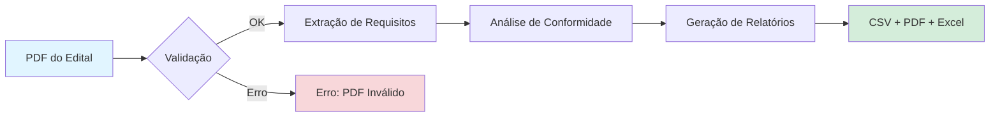
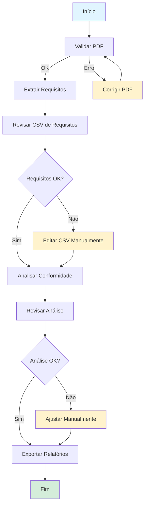
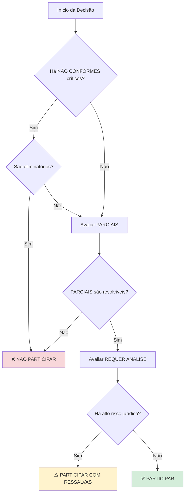

# BidAnalyzee - Tutorial Completo

**Versão:** 1.0
**Data:** 16 de novembro de 2025
**Tempo estimado:** 30-45 minutos

---

## 📋 O que você vai aprender

Neste tutorial você vai:
- ✅ Configurar o BidAnalyzee do zero
- ✅ Processar seu primeiro edital (Modo FLOW)
- ✅ Executar análise passo a passo (Modo Assistido)
- ✅ Interpretar resultados e tomar decisões
- ✅ Customizar exports e relatórios

---

## 🎯 Cenário do Tutorial

Você é analista de propostas em uma empresa de segurança eletrônica. Recebeu um edital de videomonitoramento e precisa:

1. Extrair todos os requisitos técnicos
2. Verificar conformidade com capacidades da empresa
3. Gerar matriz de conformidade profissional
4. Decidir: participar ou não da licitação?

**Arquivo de exemplo:** `edital_videomonitoramento_2025.pdf` (fictício)

---

## 🚀 Parte 1: Configuração Inicial

### Passo 1.1: Instalação

```bash
# Clone o repositório
git clone https://github.com/HackThePlanetBR/BidAnalyzee.git
cd BidAnalyzee

# Crie ambiente virtual (recomendado)
python3 -m venv venv
source venv/bin/activate  # Linux/Mac
# ou
venv\Scripts\activate  # Windows

# Instale dependências
pip install -r requirements.txt
```

**Tempo:** ~3-5 minutos

### Passo 1.2: Instalar Tesseract OCR

**Ubuntu/Debian:**
```bash
sudo apt-get update
sudo apt-get install tesseract-ocr tesseract-ocr-por
```

**macOS:**
```bash
brew install tesseract tesseract-lang
```

**Verificação:**
```bash
tesseract --version
# Deve mostrar: tesseract 4.x.x ou superior
```

### Passo 1.3: Configurar Ambiente

```bash
# Copie template
cp .env.example .env

# Edite se necessário (valores padrão geralmente OK)
nano .env
```

**Configuração mínima:** Nenhuma! Valores padrão funcionam.

### Passo 1.4: Indexar Base de Conhecimento

```bash
python scripts/index_knowledge_base.py
```

**Saída esperada:**
```
🔍 Indexando base de conhecimento...
✅ Encontrados 8 documentos
📚 Processando chunks...
✅ 245 chunks criados
🚀 Criando índice FAISS...
✅ Índice salvo em data/knowledge_base/faiss_index/

✅ INDEXAÇÃO COMPLETA!
```

**Tempo:** ~1-2 minutos

---

## 📄 Parte 2: Modo FLOW (Automação Completa)

### Visão Geral do Fluxo



### Passo 2.1: Preparar Edital

**Coloque seu PDF no diretório:**
```bash
cp ~/Downloads/edital.pdf ./edital_teste.pdf
```

**Ou use um edital de exemplo** (se disponível em `tests/fixtures/`):
```bash
cp tests/fixtures/edital_complexo/edital.pdf ./edital_teste.pdf
```

### Passo 2.2: Executar Modo FLOW

```bash
python scripts/analyze_edital_full.py edital_teste.pdf
```

**O que vai acontecer:**

```
╔═══════════════════════════════════════════════════════════╗
║         BidAnalyzee - Análise Automática (FLOW)          ║
╚═══════════════════════════════════════════════════════════╝

📄 Edital: edital_teste.pdf
🕐 Início: 2025-11-16 14:30:00

[1/4] 🔍 Validando PDF...
  ✅ Tamanho: 2.3 MB (dentro do limite)
  ✅ Formato: PDF válido
  ✅ Páginas: 45
  ✅ Texto extraível: Sim
  ✅ Validação completa!

[2/4] 📋 Extraindo requisitos...
  🔄 Processando páginas 1-45...
  ✅ 87 requisitos extraídos
  ✅ CSV salvo: data/deliveries/20251116_143000_edital_teste/requirements.csv

[3/4] 🎯 Analisando conformidade...
  🔄 Requisito 1/87: Câmeras IP Full HD...
  🔄 Requisito 2/87: Storage mínimo 30 dias...
  ...
  ✅ 87 análises concluídas
  ✅ CSV salvo: data/deliveries/20251116_143000_edital_teste/analysis_conformidade.csv

[4/4] 📊 Gerando relatórios...
  ✅ PDF: relatorio.pdf
  ✅ Excel: relatorio.xlsx

╔═══════════════════════════════════════════════════════════╗
║                    ✅ ANÁLISE COMPLETA                    ║
╚═══════════════════════════════════════════════════════════╝

📂 Resultados em: data/deliveries/20251116_143000_edital_teste/

📊 Resumo:
  - Total de requisitos: 87
  - CONFORME: 65 (75%)
  - NÃO CONFORME: 8 (9%)
  - PARCIALMENTE CONFORME: 10 (11%)
  - REQUER ANÁLISE: 4 (5%)

⚠️  Atenção: 4 requisitos precisam de análise humana!
```

**Tempo:** 20-40 minutos (depende do edital)

### Passo 2.3: Revisar Resultados

```bash
cd data/deliveries/20251116_143000_edital_teste/
ls -lh
```

**Arquivos gerados:**
```
-rw-r--r-- requirements.csv          (15 KB)
-rw-r--r-- analysis_conformidade.csv (45 KB)
-rw-r--r-- relatorio.pdf             (234 KB)
-rw-r--r-- relatorio.xlsx            (128 KB)
```

**Abra o Excel:**
```bash
xdg-open relatorio.xlsx  # Linux
# ou
open relatorio.xlsx      # macOS
# ou
start relatorio.xlsx     # Windows
```

**Abas no Excel:**
1. **Resumo** - Estatísticas gerais
2. **Conformes** - Requisitos OK
3. **Não Conformes** - Problemas críticos
4. **Parciais** - Atenção necessária
5. **Requer Análise** - Validação humana obrigatória

---

## 🔄 Parte 3: Modo Assistido (Passo a Passo)

### Fluxo Detalhado



### Passo 3.1: Validar PDF

```bash
python scripts/validate_pdf.py edital_teste.pdf
```

**Saída esperada:**
```
╔═══════════════════════════════════════╗
║       Validação de PDF - BidAnalyzee       ║
╚═══════════════════════════════════════╝

📄 Arquivo: edital_teste.pdf

🔍 Executando validações...

✅ [1/6] Arquivo existe e é acessível
✅ [2/6] Tamanho: 2.3 MB (dentro do limite de 500 MB)
✅ [3/6] Formato PDF válido
✅ [4/6] Não está corrompido
✅ [5/6] Contém 45 páginas
✅ [6/6] Texto extraível: Sim (OCR não necessário)

╔═══════════════════════════════════════╗
║     ✅ VALIDAÇÃO COMPLETA - PDF APROVADO     ║
╚═══════════════════════════════════════╝

📊 Resumo:
  - Tamanho: 2.3 MB
  - Páginas: 45
  - Texto: Extraível
  - OCR: Não necessário

✅ PDF pronto para processamento!
```

**Se houver erro:**
```
❌ [2/6] Tamanho: 650 MB (acima do limite de 500 MB)

╔═══════════════════════════════════════╗
║          ❌ VALIDAÇÃO FALHOU           ║
╚═══════════════════════════════════════╝

Problema: Arquivo muito grande
Solução sugerida: Comprima o PDF ou divida em partes menores
```

### Passo 3.2: Extrair Requisitos

**Via Claude Code (se disponível):**
```
/structure-edital edital_teste.pdf
```

**Ou via Python direto:**
```bash
python scripts/analyze_edital_structure.py edital_teste.pdf
```

**Saída:**
```
🔍 Analisando estrutura do edital...

📄 Páginas: 45
📋 Seções identificadas: 12

🔄 Extraindo requisitos...

[1/45] Processando página 1...
  ✅ 3 requisitos encontrados
[2/45] Processando página 2...
  ✅ 5 requisitos encontrados
...

✅ Extração completa!
  - Total: 87 requisitos
  - Categorias: 8
  - Arquivo: requirements.csv

📊 Distribuição por categoria:
  - Hardware: 32 requisitos
  - Software: 18 requisitos
  - Infraestrutura: 12 requisitos
  - Serviços: 10 requisitos
  - Documentação: 8 requisitos
  - Garantia: 4 requisitos
  - Treinamento: 2 requisitos
  - Outros: 1 requisito
```

### Passo 3.3: Revisar CSV de Requisitos

```bash
# Abra no Excel ou LibreOffice
xdg-open requirements.csv
```

**Estrutura do CSV:**
| item | categoria | descricao | especificacao_tecnica | obrigatorio | referencia_edital |
|------|-----------|-----------|----------------------|-------------|-------------------|
| 1 | Hardware | Câmeras IP | Full HD 1080p, visão noturna | Sim | Pág. 12, item 3.1 |
| 2 | Software | Sistema de gravação | H.265, redundância | Sim | Pág. 14, item 3.5 |

**Validação manual:**
- ✅ Todos os requisitos importantes foram extraídos?
- ✅ Categorização está correta?
- ✅ Especificações técnicas estão completas?

**Se necessário, edite diretamente no CSV e salve.**

### Passo 3.4: Analisar Conformidade

```
/analyze-edital requirements.csv
```

**Ou:**
```bash
python scripts/analyze_conformity_e2e.py requirements.csv
```

**Processamento:**
```
🎯 Iniciando análise de conformidade...

📊 Requisitos a analisar: 87

[1/87] Analisando: Câmeras IP Full HD...
  🔍 Buscando na base de conhecimento...
  📚 3 evidências encontradas
  ✅ Veredicto: CONFORME

[2/87] Analisando: Storage mínimo 30 dias...
  🔍 Buscando na base de conhecimento...
  📚 2 evidências encontradas
  ⚠️  Veredicto: PARCIALMENTE CONFORME

...

[87/87] Analisando: Certificação ISO 9001...
  🔍 Buscando na base de conhecimento...
  ❌ Nenhuma evidência encontrada
  🔍 Veredicto: REQUER ANÁLISE

✅ Análise completa!
  - Arquivo: analysis_conformidade.csv
```

### Passo 3.5: Revisar Análise

```bash
xdg-open analysis_conformidade.csv
```

**Colunas adicionadas:**
| veredicto | justificativa | evidencias | nivel_confianca | recomendacoes |
|-----------|---------------|------------|-----------------|---------------|
| CONFORME | Câmeras atendem especificações... | requisitos_tecnicos.md:45 | Alto | Nenhuma ação necessária |
| PARCIALMENTE CONFORME | Storage atende mínimo mas... | Lei_14133.md:120 | Médio | Verificar capacidade real |

**Foque em:**
1. ❌ **NÃO CONFORME** - Problemas críticos
2. 🔍 **REQUER ANÁLISE** - Validação humana obrigatória
3. ⚠️ **PARCIALMENTE CONFORME** com confiança "Baixo" ou "Médio"

### Passo 3.6: Exportar Relatórios

**PDF:**
```bash
python scripts/export_pdf.py analysis_conformidade.csv
```

**Excel:**
```bash
python scripts/export_excel.py analysis_conformidade.csv
```

**Saída:**
```
📄 Gerando relatório PDF...
  ✅ Capa criada
  ✅ Resumo executivo adicionado
  ✅ Tabela de conformidade gerada
  ✅ Gráficos inseridos
  ✅ Recomendações incluídas
  ✅ PDF salvo: relatorio.pdf

📊 Gerando planilha Excel...
  ✅ Aba "Resumo" criada
  ✅ Aba "Conformes" (65 itens)
  ✅ Aba "Não Conformes" (8 itens)
  ✅ Aba "Parciais" (10 itens)
  ✅ Aba "Requer Análise" (4 itens)
  ✅ Formatação condicional aplicada
  ✅ Excel salvo: relatorio.xlsx
```

---

## 📊 Parte 4: Interpretando e Decidindo

### Cenário: Resultado da Análise

```
📊 Resumo da Análise - Edital Videomonitoramento 2025

Total de requisitos: 87

✅ CONFORME: 65 (75%)
❌ NÃO CONFORME: 8 (9%)
⚠️  PARCIALMENTE CONFORME: 10 (11%)
🔍 REQUER ANÁLISE: 4 (5%)
```

### Análise dos NÃO CONFORMES

| Item | Requisito | Por quê? | Gravidade | Ação |
|------|-----------|----------|-----------|------|
| 23 | Certificação ANATEL | Empresa não possui | **CRÍTICO** | ❌ Inabilitação |
| 45 | 5 anos de experiência | Empresa tem 3 anos | **CRÍTICO** | ❌ Inabilitação |
| 67 | ISO 27001 | Não possui | Alto | ⚠️ Pode ser eliminatório |
| 71 | Capital social 5M | Empresa tem 2M | Alto | ⚠️ Verificar se eliminatório |

### Análise dos PARCIALMENTE CONFORMES

| Item | Requisito | Situação | Ação |
|------|-----------|----------|------|
| 12 | Storage 60 dias | Temos 45 dias | ✅ Negociável (não eliminatório) |
| 34 | 10 técnicos certificados | Temos 7 | ✅ Contratar mais 3 |
| 56 | Câmeras PTZ 360° | Temos 270° | ⚠️ Verificar se aceitam |

### Análise dos REQUER ANÁLISE

| Item | Requisito | Por quê requer análise? | Ação |
|------|-----------|-------------------------|------|
| 78 | "Experiência comprovada em órgãos públicos" | Ambíguo - quantos? qual período? | 🔍 Solicitar esclarecimento |
| 82 | "Solução de ponta" | Subjetivo, sem critério objetivo | 🔍 Interpretar com especialista |

### Decisão: Participar ou Não?



**Para nosso cenário:**

1. **NÃO CONFORMES críticos:** Certificação ANATEL + 5 anos experiência
   - ➡️ **Ambos eliminatórios** (segundo edital)

2. **DECISÃO:** ❌ **NÃO PARTICIPAR**

**Justificativa:**
- Certificação ANATEL é obrigatória por lei
- 5 anos de experiência é critério de habilitação
- Não há como resolver antes do certame

**Recomendação:**
- Não gastar recursos em proposta
- Focar em outros editais viáveis
- Trabalhar para obter certificações necessárias

---

## 🔍 Parte 5: Funcionalidades Avançadas

### Busca Rápida na Base de Conhecimento

**Cenário:** Você quer apenas consultar algo específico, sem análise completa.

```bash
python scripts/rag_search.py "prazo validade proposta licitação"
```

**Ou via Orchestrator:**
```
*buscar "prazo validade proposta licitação"
```

**Resultado:**
```
📚 RESULTADOS DA BUSCA (5 encontrados)

[1] Lei 8.666/93:120 (similaridade: 0.92) ⭐
"O prazo de validade das propostas será de 60 (sessenta) dias,
contado da data de abertura das propostas, salvo disposição em
contrário no edital."

[2] Lei 14.133/2021:89 (similaridade: 0.87) ⭐
"A validade da proposta não poderá ser inferior a 60 (sessenta) dias,
contados da data da sessão pública de abertura das propostas."

[3] requisitos_tecnicos.md:45 (similaridade: 0.78)
"Propostas técnicas devem manter validade mínima de 90 dias para
projetos de grande porte."

[4] FAQ_licitacoes.md:112 (similaridade: 0.72)
"Prorrogação de validade só pode ocorrer com anuência do proponente."

[5] boas_praticas.md:67 (similaridade: 0.68)
"Recomenda-se oferecer validade superior ao mínimo exigido."
```

### Validar CSVs Customizados

```bash
# Validar requisitos extraídos
python scripts/validate_csv.py requirements.csv --type requirements

# Validar análise de conformidade
python scripts/validate_csv.py analysis.csv --type analysis
```

### Listar Sessões Anteriores

```bash
python scripts/orchestrator_list.py 10
```

**Saída:**
```
📋 ÚLTIMAS 10 SESSÕES

[1] 20251116_143000_edital_teste
    Status: Completo ✅
    Requisitos: 87
    Conformes: 65 (75%)
    Duração: 38min

[2] 20251115_091500_edital_obras
    Status: Completo ✅
    Requisitos: 124
    Conformes: 98 (79%)
    Duração: 52min

...
```

---

## ✅ Checklist Final

Após completar este tutorial, você deve ser capaz de:

- [x] Instalar e configurar BidAnalyzee
- [x] Indexar base de conhecimento
- [x] Validar PDFs de editais
- [x] Executar análise completa (Modo FLOW)
- [x] Executar análise passo a passo (Modo Assistido)
- [x] Interpretar veredictos de conformidade
- [x] Validar evidências citadas
- [x] Exportar relatórios profissionais (PDF + Excel)
- [x] Tomar decisões baseadas nos resultados
- [x] Usar ferramentas avançadas (busca RAG, validações)

---

## 🎓 Próximos Passos

Agora que você domina o básico:

1. **Customize a base de conhecimento**
   - Adicione documentos do seu domínio
   - Re-indexe com `python scripts/index_knowledge_base.py`

2. **Processe editais reais**
   - Comece com editais simples
   - Valide resultados com especialistas
   - Refine base de conhecimento conforme necessário

3. **Integre no seu workflow**
   - Automatize com scripts
   - Integre com sistemas existentes
   - Padronize processo da equipe

4. **Contribua com melhorias**
   - Reporte bugs encontrados
   - Sugira novas funcionalidades
   - Compartilhe casos de uso

---

## 📚 Recursos Adicionais

- **[USER_GUIDE.md](USER_GUIDE.md)** - Guia completo de referência
- **[FAQ.md](FAQ.md)** - Perguntas frequentes
- **[README.md](../README.md)** - Overview do projeto
- **[OPERATING_PRINCIPLES.md](../OPERATING_PRINCIPLES.md)** - Framework SHIELD

---

## 🎉 Parabéns!

Você completou o tutorial completo do BidAnalyzee!

Agora você está pronto para:
- ✅ Acelerar suas análises de licitações
- ✅ Reduzir erros e retrabalho
- ✅ Tomar decisões mais informadas
- ✅ Padronizar processos da equipe

**Dúvidas?** Consulte a [FAQ](FAQ.md) ou abra uma issue no GitHub.

**Boas análises!** 🚀

---

**Última atualização:** 16/11/2025
**Versão:** Sprint 10
